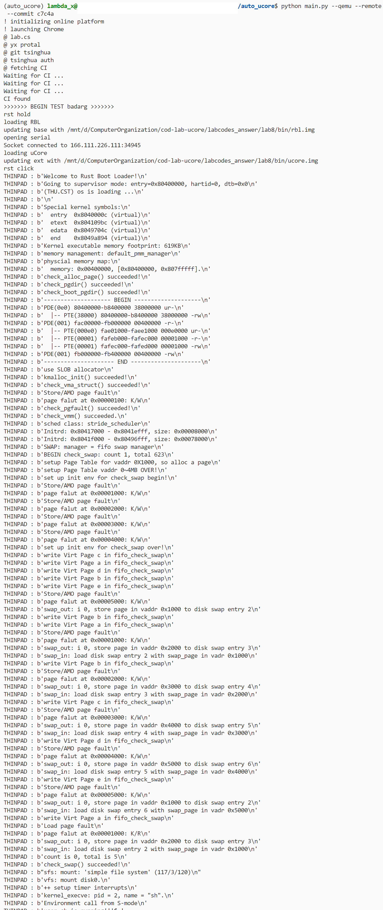
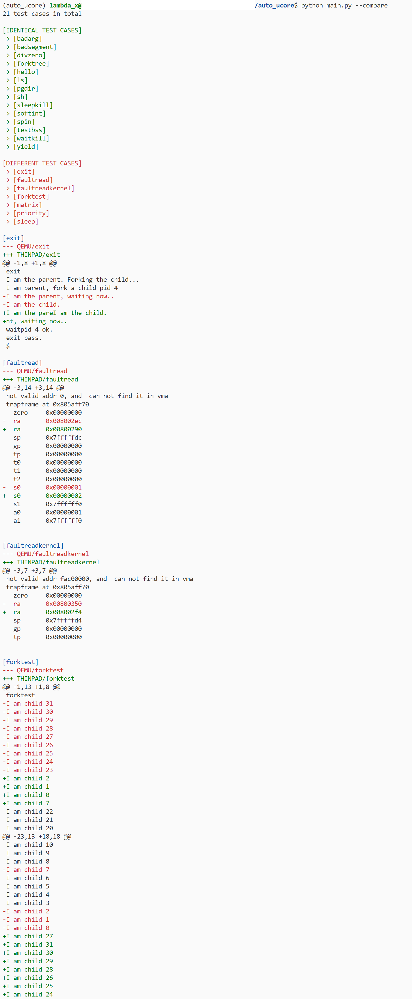

# uCore player for cod-lab-2022

Having built up a CPU baseline, manually run all uCore tests for every new revision is necessary but tedious. This tool automatically runs test cases and compares the output of your CPU and that of QEMU. 

## Setup on Ubuntu

[//]: # (- Install [riscv64-unknown-elf-gcc]&#40;https://static.dev.sifive.com/dev-tools/freedom-tools/v2020.08/riscv64-unknown-elf-gcc-10.1.0-2020.08.2-x86_64-linux-ubuntu14.tar.gz&#41;)
- Install Qemu 5.0.0, see [uCore-Tutorial](https://learningos.github.io/uCore-Tutorial-Guide-2022S/chapter0/1setup-devel-env.html#qemu)
- Install Chrome.
- Compile `ucore`.
- Install `./requirements.txt`

## Usage

- Create `./config.json`.

    ```json
    {
        "user_id": "<user_id>",
        "user_password": "<user_password>",
        "ucore_root": "/cod-lab-ucore/labcodes_answer/lab8",  // where we have `Makefile` and `bin`
    }
    ```

- launch
    ```bash
    python main.py --qemu --remote --compare --timeout 30
    ```

## Acknowledgement
Thanks to [c7w](https://github.com/c7w) and [ayf19](https://github.com/ayf19). We've advanced swiftly because the cost of communication is saved.

## Examples
- Running tests


- Comparing logs
